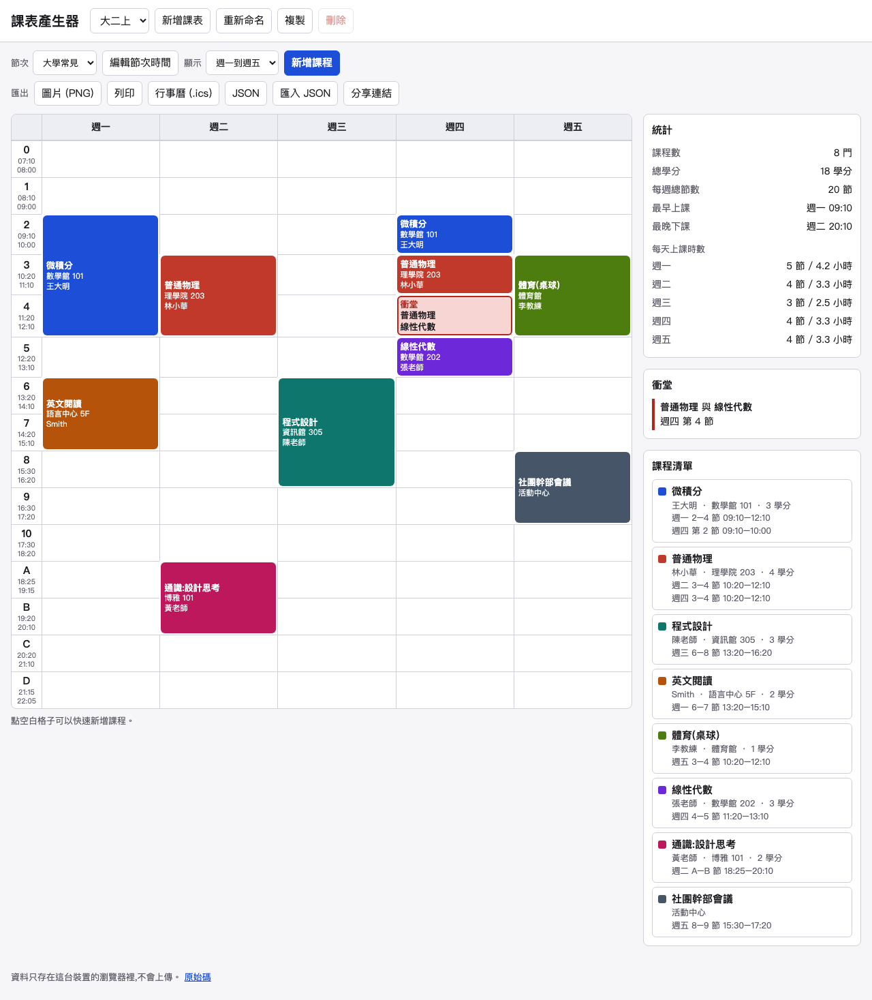

# 課表產生器
A zero-dependency, offline-capable timetable maker for Taiwanese university and high-school students, with conflict detection, PNG/print/ICS export and shareable links.

**Demo:** https://useless-husband.github.io/class-timetable/



## 是什麼

排課表用的網頁工具。純靜態、不用安裝、不用網路、不用帳號,資料只存在你自己的瀏覽器裡。

## 功能

- 節次組合:「大學常見」(0、1–10、A–D 夜間節次)與「高中」(早自習、1–8 節),每一節的起訖時間都能自己改。
- 顯示範圍:週一到週五(預設)、到週六、到週日;有週六日的課時會自動多顯示。
- 課程:課名、老師、教室、學分、星期、節次(可多節、一週可有多個時段)、8 色顏色、備註。點空白格子可以快速新增。
- 衝堂偵測:衝突的格子用斜線與紅框標示,並列出「哪兩門課、星期幾、第幾節」。
- 統計:總學分、每天上課節數與時數、最早上課與最晚下課時間。
- 匯出:
  - PNG 圖片(自己用 Canvas 畫,2 倍解析度)
  - 列印(A4 橫向一頁)
  - ICS 行事曆(每週重複事件,時區 Asia/Taipei,可匯入 Google / Apple 行事曆)
  - JSON 匯出與匯入
- 分享:課表壓縮編碼在網址 `#s=...` 裡,對方打開就是唯讀預覽,可以「複製到我的課表」。
- 自動儲存在 localStorage,可以建立多份課表(例如「大二上」「大二下」)、重新命名、複製、刪除。
- 支援淺色 / 深色模式,手機寬度可用,鍵盤可操作。

## 安裝與執行

不需要安裝任何東西。任選一種方式:

**方式一:直接用線上版**

打開上面的 Demo 連結即可。

**方式二:在自己電腦上執行**

因為使用了 ES module,不能直接用雙擊開啟 `index.html`(瀏覽器會擋),需要開一個本機伺服器。電腦有 Python 3 的話:

```bash
git clone https://github.com/useless-husband/class-timetable.git
cd class-timetable
python3 -m http.server 8000
```

然後用瀏覽器開 http://localhost:8000 。要停止就在終端機按 `Ctrl + C`。

沒有 Python 但有 Node.js 的話,可以改用:

```bash
npx serve .
```

## 使用範例

1. 點課表上的空格(例如週一第 2 節),填課名「微積分」、教室「數學館 101」,儲存。
2. 再新增一門週一第 3 節的課,這時兩門課的交界格會變成斜線紅框,右側「衝堂」區會出現:

   ```
   微積分 與 普通物理
   週一 第 3 節
   ```

3. 按「行事曆 (.ics)」,輸入學期開始 2026-09-14、結束 2027-01-15,下載後拖進 Google 行事曆。產生的內容大致如下:

   ```
   BEGIN:VEVENT
   UID:m1abc-0-0@class-timetable
   DTSTART;TZID=Asia/Taipei:20260914T091000
   DTEND;TZID=Asia/Taipei:20260914T121000
   RRULE:FREQ=WEEKLY;BYDAY=MO;UNTIL=20270115T155959Z
   SUMMARY:微積分
   LOCATION:數學館 101
   END:VEVENT
   ```

4. 按「分享連結」複製網址傳給同學,他打開就能看。

## 專案結構

```
index.html        頁面
style.css         樣式(含深色模式與列印)
src/
  periods.js      節次預設、時間計算、連續節次合併
  schedule.js     格子占用、衝堂偵測、統計
  ics.js          ICS 產生(CRLF、折行、跳脫、RRULE)
  share.js        網址分享(deflate-raw + base64url)
  validate.js     匯入 / 分享 / 儲存資料的驗證與清理
  store.js        localStorage 存取
  render.js       Canvas 畫 PNG
  palette.js      8 色調色盤
  app.js          介面與事件
tests/            node --test 測試
.github/workflows/ci.yml
```

## 如何跑測試

需要 Node.js 20 以上,沒有任何依賴要裝:

```bash
npm test
```

測試涵蓋節次與時間計算、衝堂判定、統計、ICS 內容(CRLF、折行、跳脫字元、UNTIL)、分享網址來回與壞資料、匯入驗證、儲存與繪圖。

## 原理簡介

- 每個時段記錄「星期 + 節次 id 清單」。衝堂就是同一格(星期 × 節次)被兩門以上不同課程占用。
- 連續的節次會合成一個區塊,起訖時間取第一節的開始與最後一節的結束;不連續的節次拆成多個事件。
- ICS 的 UNTIL 用 UTC 表示(台北當天 23:59:59 = 15:59:59Z),內容行依 RFC 5545 以 75 位元組折行且不切斷中文字。
- 分享連結把課表轉成短陣列格式,用瀏覽器內建的 `CompressionStream('deflate-raw')` 壓縮再轉 base64url。解碼時限制解壓後大小,並經過同一套驗證。
- 所有外來資料(JSON 檔、分享連結、localStorage)都會先經過 `validate.js`:型別、範圍、長度、重複 id、不存在的節次都會被清理或略過,壞資料不會讓程式壞掉。

## 已知限制

- 分享連結長度隨課程數增加,課程很多時網址可能超過部分通訊軟體的長度上限。
- PNG 圖片使用系統字體繪製,不同作業系統字型外觀會略有差異。
- 需要支援 `CompressionStream` 的瀏覽器(近年的 Chrome、Edge、Safari、Firefox 皆可)。

## 授權

MIT License,詳見 [LICENSE](LICENSE)。
